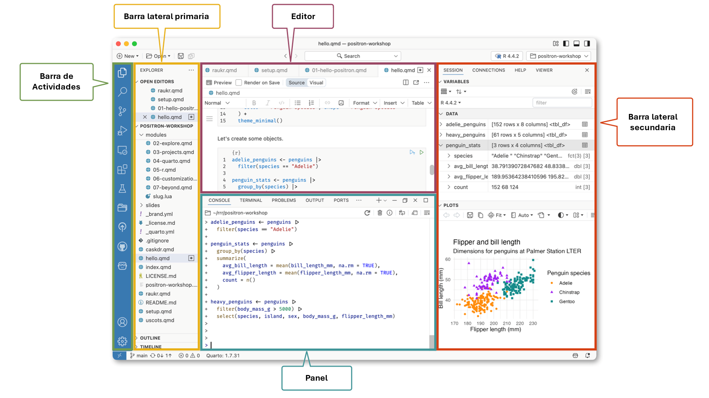

## Contenido

- ¿Por qué adoptar la reproducibilidad?
- Git (Control de Versiones).
- Entorno de análisis estadístico R.
- Positron.
- ¿Qué es Quarto?
- Cierre

## ¿Por qué adoptar la reproducibilidad?

:::incremental
- La reproducibilidad permite que otra persona (o uno mismo, meses después) obtenga los mismos resultados a partir de los mismos datos y código.
- Evita el problema de "funcionaba en mi computadora" al documentar el entorno y los pasos exactos del análisis.
- Reduce errores de manipulación manual (copiar y pegar, editar celdas a mano) que son difíciles de rastrear.
- Facilita la revisión y auditoría de los resultados por terceros (colegas, revisores, público).
- Permite actualizar el análisis fácilmente cuando llegan datos nuevos, sin repetir el trabajo desde cero.
- Evita la pérdida de trabajo y la confusión de versiones (archivos como "final_v2_definitivo-este-sí.xlsx").
:::


## ¿Qué es Git (control de versiones)?

:::incremental
- Sistema para registrar el historial de cambios de un directorio de proyecto (código, texto, datos).
- Permite volver a versiones anteriores en cualquier momento.
- Cada cambio queda documentado: quién, qué y por qué (commits).
- El historial se organiza como una línea de commits encadenados, cada uno con su "padre".
- Las ramas (branches) son líneas de desarrollo paralelas.
- `main` suele ser la rama principal; se crean otras para features o pruebas sin afectarla.
- Los cambios de una rama se integran a otra mediante merge (o pull request en GitHub).
- GitHub es una plataforma para alojar y compartir repositorios de git en la nube.
:::

## Inicializar un repositorio y subirlo a GitHub

```{.bash code-line-numbers="|1|2|3|4-5|6"}
git init
git add .
git commit -m "Commit inicial"
git remote add origin mi-repositorio-en-github.git
git branch -M main
git push -u origin main
```
## El entorno de análisis R 

R es un conjunto integrado de herramientas de software para la manipulación de datos, cálculo y visualización gráfica. Incluye:

::: incremental
-   Una eficaz herramienta para el manejo y almacenamiento de datos,
-   Un conjunto de operadores para cálculos en matrices,
-   Una colección grande, coherente e integrada de herramientas intermedias para el análisis de datos,
-   herramientas gráficas para el análisis y visualización de datos, ya sea en pantalla o en copia impresa, y
-   Un lenguaje de programación bien desarrollado, simple y eficaz que incluye condicionales, bucles, funciones recursivas definidas y herramientas para ingreso y salida de información.
-   Un ambiente en el que se han implementado funciones estadísticas.
:::

## Positron

- Positron es un ambiente para trabajar con código (Integrated Development Environment ---IDE---) moderno y con capacidad para ser extendido dirigido al trabajo de ciencia de datos, construido sobre la plataforma de Code OSS (la versión de fuente abierta de Visual Studio Code). Combina el poder de un ambiente de trabajo poderoso con herramientas explícitas para el trabajo de ciencia de datos con R y Python.

## 



## ¿Qué es Quarto?

:::incremental
- Un sistema de publicación científica y técnica de fuente abierta.
- Permite combinar texto en markdown, código (R, Python, Julia, entre otros) y sus resultados en un mismo documento.
- Un mismo archivo fuente se puede convertir a múltiples formatos: HTML, PDF, Word, presentaciones, sitios web, dashboards.
- El código se ejecuta al momento de generar el documento, por lo que el texto, las cifras y los gráficos siempre reflejan los datos actuales.
- Es la herramienta con la que construimos este sitio: la memoria de cálculo, el reporte, el dashboard y esta misma presentación.
- Así logramos que el análisis sea reproducible: cualquier persona puede tomar el mismo código y los mismos datos y obtener exactamente los mismos resultados.
:::

## 

::: {.absolute top="50%" left="50%" style="transform: translate(-50%, -50%); text-align: center;"}
¡Gracias!
:::


